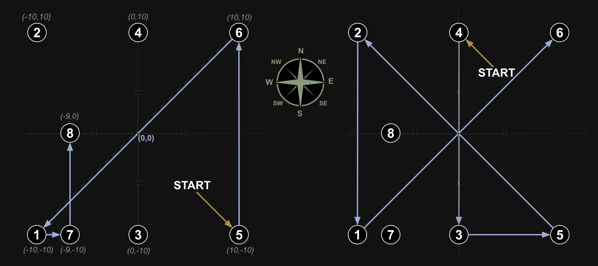

# Dodgeball

Kids are playing a game called Dodgeball. The game is played on a large playing field, each player standing in a different spot with integer coordinates.

The game starts with one player receiving a ball from one of the main eight compass directions: N, NE, E, SE, S, SW, W, NW (listed clockwise order).

Whenever a player gets the ball, he or she rotates clockwise in multiples of 45 degrees (starting with the next direction from which he or she has just received the ball), until they find another player standing in that exact direction. The player then throws the ball and leaves the field. If there are multiple players in the same direction, the ball always go the to nearest one. Next player continues with this process and so the game goes on, until the player that received the ball does not have anybody else to throw the ball to.

The picture below shows how the game could go for similar starting positions of players but different starting players and directions.

## Task:
You are given the initial description of the playing field and the players. Find out how many throws will the players make before the game ends. The firs player receiving the ball does not count as a throw. Also find out which player is the last one to receive the ball.

## Input description:
The first line of the input gives the number of test cases T <= 100. Description of T test cases follows.

Input for a single test case starts with a line containing a single integer N (2 <= N <= 1000), number of players in the game.

Each of the following N lines contains two integers Xp Yp (-10^9 <= Xp, Yp <= 10^9), where Xp Yp are the coordinates of the p-th player on the playing field.

The next line contains string D-direction the first player received the ball from. D is one of { N, E, S, W, NW, NE, SW, SE }. Vector (1,1) points to NE.

The last line contains an integer S (1 <= S <= N), index of the starting player.




## Output Description:
For each test case, output one line containing two integers separated by a single space, the number of throws for the corresponding test cases and number of the last player that held the ball.

## Example input:
```
2
8
-10 -10
-10 10
0 -10
0 10
10 -10
10 10
-9 -10
-9 0
NW
5
8
-1000000 -1000000
-1000000 1000000
0 -1000000
0 1000000
1000000 -1000000
1000000 1000000
-999999 -1000000
-999999 0
SE
4
```
## Example output:
```
4 8
5 6
```
In the first test case the ball travels between players with number 5->6->1->7->8. In the second test case the ball travels between players with numbers 4->3->5->2->1->6.
